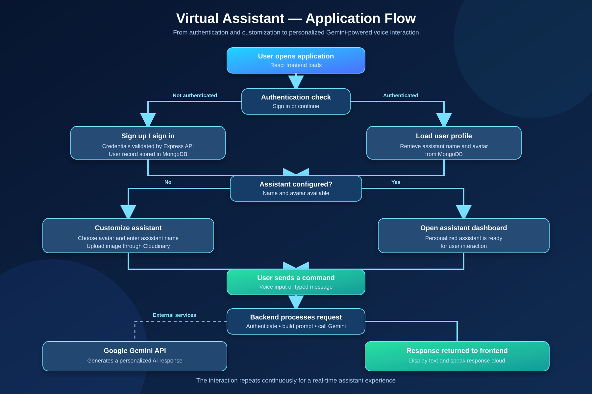

# Virtual Assistant

An AI-powered, full-stack virtual assistant that combines personalized assistant profiles, voice interaction, and conversational intelligence in a modern web application.

Users can create an account, select or upload an assistant avatar, give the assistant a custom name, and interact with it through typed or spoken commands. The backend builds a personalized prompt and uses the Google Gemini API to generate responses.

## Project highlights

- Personalized assistant name and avatar
- User registration, login, logout, and authenticated sessions
- Voice-enabled interaction using browser speech capabilities
- Gemini-powered conversational responses
- MongoDB persistence for user profiles and assistant configuration
- Cloudinary support for assistant image uploads
- Responsive React interface with a guided setup experience
- Express API with protected user routes

## Application flow



The main flow is:

1. The user opens the React application.
2. The frontend checks whether an authenticated session exists.
3. A new user creates an account, while an existing user signs in.
4. The user selects an assistant image and enters a custom assistant name.
5. Assistant configuration is saved to the backend and MongoDB.
6. The user submits a typed or spoken command.
7. The frontend sends the command to the authenticated Express API.
8. The backend retrieves the user profile and creates a personalized Gemini prompt.
9. Google Gemini generates the response.
10. The response is returned to the frontend, displayed to the user, and read aloud when voice output is enabled.

## Architecture

```text
┌───────────────┐       HTTP/JSON        ┌──────────────────┐
│ React + Vite  │ ─────────────────────> │ Express API      │
│ Frontend      │ <───────────────────── │ Authentication   │
└───────┬───────┘                         └───────┬──────────┘
        │                                         │
        │ Browser Speech APIs                     │ Mongoose
        │                                         │
        ▼                                         ▼
  Voice input/output                         MongoDB
                                                  │
                    ┌─────────────────────────────┼─────────────────┐
                    │                             │                 │
                    ▼                             ▼                 ▼
              Google Gemini                  Cloudinary       JWT cookies
              AI responses                  Assistant images  Authenticated sessions
```

## Technology stack

### Frontend

- React 19
- Vite
- React Router
- Axios
- Tailwind CSS
- React Icons
- Web Speech API for voice input and output

### Backend

- Node.js
- Express 5
- MongoDB with Mongoose
- JSON Web Tokens
- bcryptjs password hashing
- Cloudinary image storage
- Multer file uploads
- Axios for external API communication

